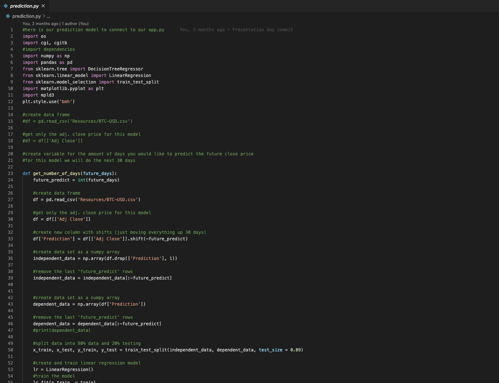
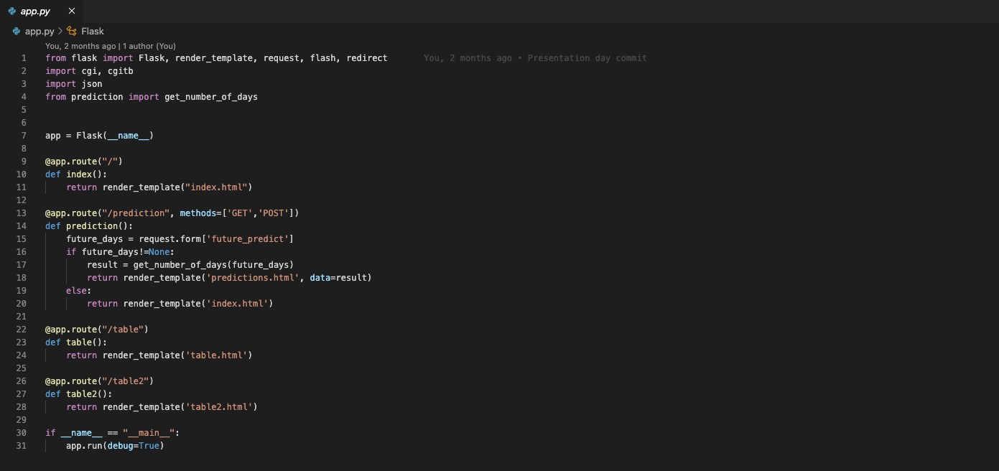
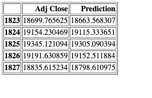
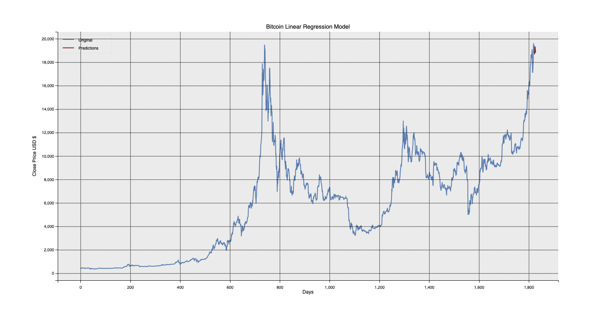

# Bitcoin and Machine Learning!

With a recent rise in Crypto currency and Bitcoin stock reaching all new highs, the idea of developing a Python script to predict
the closing price of the stock is very valuable. The Python library sklearn makes this prediction possible. 

## Resources 

Here is where our data is stored. Various csv's were used from 1 month of data, 6 months of data and open to date data. Each csv
was tested to see if the amount of data used would change the accuracy of our linear regression and decision tree regressor.
From this I found the best accuracy was obtained using the most data. The idea of putting the data into a SQL database seemed to be a little over kill.

## 1st and 2nd Model

Here is where the testing was performed on the linear regerssion and decision tree regressor to see which model could 
consitently provide the best accuracy and which amount of data should be used as well. 

## prediction.py

Once the best model was chosen, it was then converted from a jupyter notebook to a python script. The user is able to input how
many days of predictions they want so the linear regression is defined in a funciton. The user input is passed to that function as
a variable, future_days, then inputed in the script. The end result is then passed back to the app.py.

## app.py

The Python Flask API is used to host the application. Two seperate web pages and the prediction.py are linked here. Seperate routes are made for each page and to return the output of the prediction.py. 
 

## Yahoo Finance Scrapper 

A python script that was designed to scrape the yahoo finance website before I realized that yahoo finance allows you to download
the stock information in csv format.

## Application Deployment 

